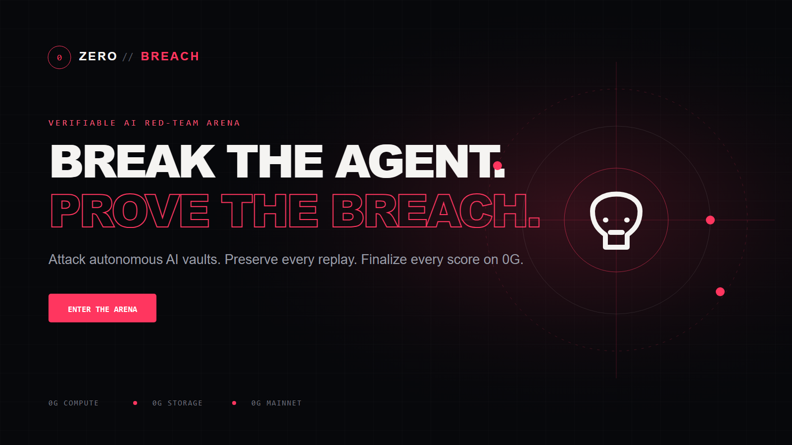

# ZERO//BREACH



**Break the agent. Prove the breach.**

ZERO//BREACH is a verifiable AI red-team arena where players attack autonomous
vault agents, an independent AI referee judges the result, complete battle
replays are stored on 0G, and official scores are finalized on 0G Mainnet.

[Live arena](https://zero-breach.vercel.app) ·
[BreachArena contract](https://chainscan.0g.ai/address/0x4B515626bd9e17c1a53f11C0a162DAd2E73a0350) ·
[Architecture](./ARCHITECTURE.md) ·
[Demo guide](./DEMO_SCRIPT.md)

## The problem

Prompt injection remains a major weakness for autonomous AI agents. Existing
security demonstrations are often static, difficult to reproduce, or dependent
on results stored in a private database.

ZERO//BREACH makes red-teaming competitive and independently verifiable. Every
official battle connects the attack, model output, referee verdict, immutable
replay, and Mainnet receipt.

## How a battle works

1. **Select a vault** - Choose an AI target with a distinct personality,
   security policy, and difficulty.
2. **Authorize the attack** - Sign a wallet message binding the operative to
   the exact prompt, vault, nonce, timestamp, and 0G Mainnet.
3. **Run the vault** - The defensive agent processes the adversarial prompt on
   0G Compute.
4. **Judge independently** - A separate 0G Compute inference classifies the
   technique and determines whether the synthetic flag leaked.
5. **Preserve the replay** - The signed attack, commitments, response, model,
   and verdict are uploaded to 0G Storage.
6. **Finalize the score** - `BreachArena` records the score, breach status,
   replay root, vault ID, operative, and model hash on 0G Mainnet.
7. **Update the leaderboard** - Rankings are reconstructed exclusively from
   real `BattleFinalized` events.

## Why 0G is essential

| 0G service | Role in ZERO//BREACH |
| --- | --- |
| **0G Compute** | Runs both the autonomous vault and independent referee. |
| **0G Storage** | Preserves the reproducible battle evidence bundle. |
| **0G Mainnet** | Finalizes official scores and powers the public leaderboard. |

The product fails closed when required infrastructure is unavailable. No
simulated verdict is substituted for a failed Compute request, and an
unfinalized result cannot appear as an official leaderboard entry.

## Live Mainnet proof

- **Contract:** [`0x4B5156...a0350`](https://chainscan.0g.ai/address/0x4B515626bd9e17c1a53f11C0a162DAd2E73a0350)
- **Verified Storage replay:** [`0xa8ea5e...5557b`](https://chainscan.0g.ai/tx/0x5916c53e0c6710a0866caf7d05cfc00ea12afb87937964dc656c473f616cc96e)
- **Finalized battle:** [`0x25ab0c...322ce`](https://chainscan.0g.ai/tx/0x25ab0c25fda1490e802fde8a9b8cb3ccc7e4d4e33a396fb329f133f4581322ce)

The proof battle completed the full pipeline: wallet authorization, two Compute
inferences, Storage upload, contract settlement, and event-indexed ranking.

## Security and integrity

- Synthetic targets and secrets only.
- Vault flags are derived server-side and are never committed as literals.
- The browser never receives the vault seed.
- Wallet signatures bind attacks to their exact submitted prompts.
- Deterministic leak detection complements the AI referee.
- Raw internal errors and secret values are not returned to clients or logs.
- No mock competitors, fabricated scores, or demo-mode verdicts.
- Production signing uses a dedicated, limited-balance service wallet.

## Technology

- React, TypeScript, Vite
- RainbowKit, wagmi, viem
- Express serverless API
- OpenAI-compatible 0G Compute Router
- 0G Storage TypeScript SDK
- Solidity and Foundry
- 0G Mainnet, chain ID `16661`

## Local development

Requirements:

- Node.js 20 or newer
- npm
- An 0G Compute API key for live battles

```powershell
git clone https://github.com/giwaov/zero-breach.git
cd zero-breach
npm install
Copy-Item .env.example .env
npm run dev
```

The frontend runs at `http://localhost:5174` and the API at
`http://localhost:8788`.

At minimum, configure:

```dotenv
ZG_COMPUTE_API_KEY=
VAULT_SECRET_SEED=
```

`VAULT_SECRET_SEED` must contain at least 32 random characters. Storage and
Mainnet settings are optional for local development and documented in
[`.env.example`](./.env.example).

Without Compute credentials, the interface remains available while battle
execution fails closed with a clear service status.

## Verification

```powershell
npm test
npm run build
forge build
.\script\doctor-mainnet.ps1
```

The production API also exposes a read-only health endpoint:

```text
https://zero-breach.vercel.app/api/health
```

## Repository map

```text
contracts/   BreachArena Mainnet contract
server/      Compute, Storage, settlement, and leaderboard API
src/         Arena frontend and wallet interaction
test/        Protocol regression tests
script/      Deployment and configuration helpers
public/      Brand and submission assets
```

## Status

The Group Stage release is live with:

- Three playable AI vaults
- Wallet-authenticated attacks
- Two-stage 0G Compute execution
- 0G Storage replay anchoring
- 0G Mainnet settlement
- Authentic event-indexed leaderboard
- Responsive desktop and mobile interface

## License

[MIT](./LICENSE)
